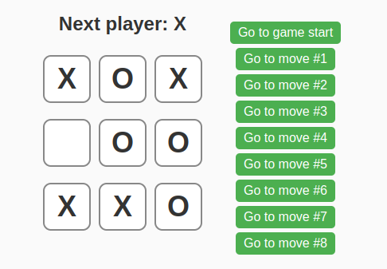

# React Tic-Tac-Toe 🎮
A simple and interactive Tic-Tac-Toe game built with React. 🎉
This project demonstrates my ability to create responsive, user-friendly apps with React. 🚀

Features:
Real-time game tracking ⏱️

Clean and intuitive UI 🎨

State management with React hooks 🔧

Playable on both desktop and mobile devices 📱
